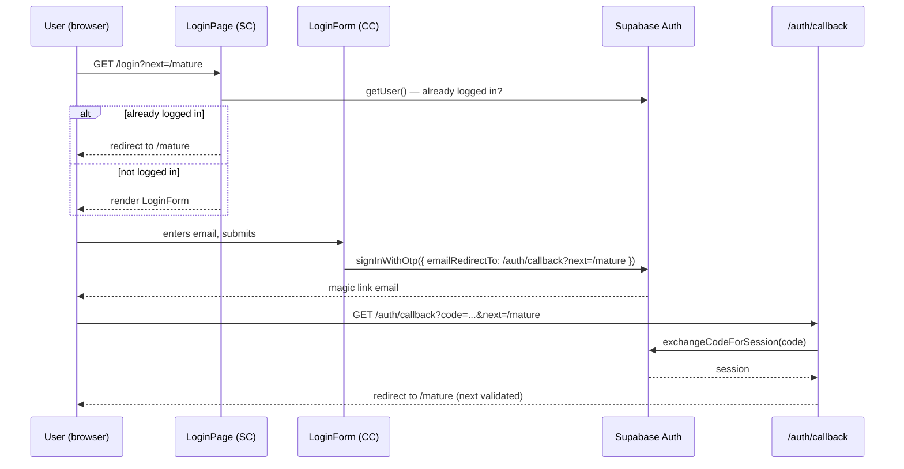
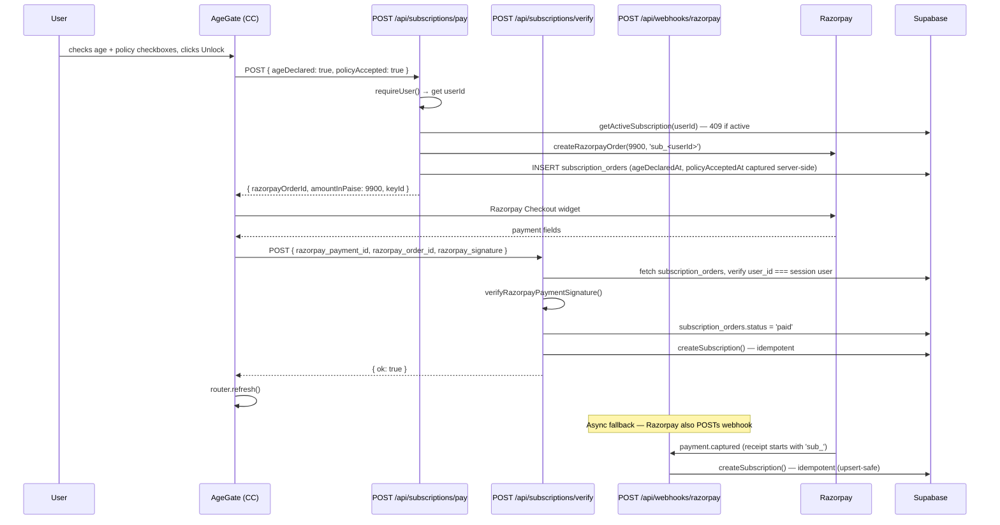
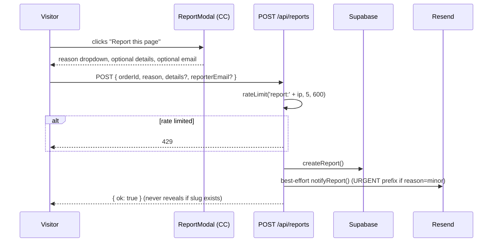
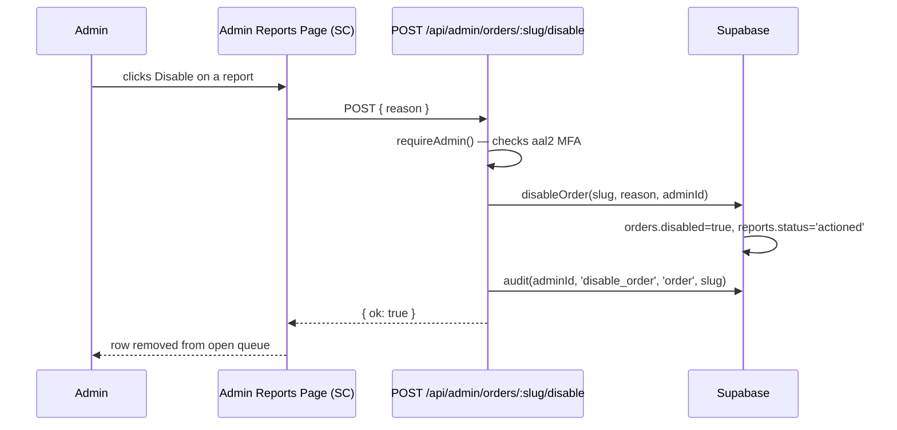

# Design Document: Platform Expansion

## Overview

Surprise Pages currently operates as a single-purpose gift-page builder with three public tiers (1–3) and a Tier 4 white-glove manual path. This feature expands the product into a two-layer platform without touching any existing public functionality.

Layer 1 — **Platform Shell**: Introduces Supabase Auth (email magic link), a role system (user / admin), MFA enforcement for admins, shared middleware, audit logging, rate limiting, and a protected admin section. These capabilities benefit all current and future modules.

Layer 2 — **Feature Modules**: Three distinct modules ship on the shell — (A) Reports & Takedown, giving any visitor a content-reporting path and admins a moderation queue; (B) Policy Pages, replacing placeholder legal text with real copy required for Razorpay KYC; (C) Mature Section, a subscription-gated (₹99/year, Razorpay) area for adult-themed gift pages running on three new template tiers (mature1/2/3) that mirror the public tier shapes.

The public tiers remain completely unchanged. No login is ever required for a customer placing a public order or viewing a public gift page.

---

## Architecture

### High-level layer diagram

```mermaid
graph TD
    subgraph Browser
        A[Public pages / builders]
        B[Login / Auth flow]
        C[Mature builders — requires session]
        D[Admin panel]
    end

    subgraph NextJS["Next.js 14 App Router"]
        MW[Middleware — session refresh + route guard]
        subgraph Routes_Public["(site) routes — public"]
            R1[builder/tier1-3]
            R2[p/slug — gift delivery]
            R3[login]
            R4[content-policy / terms / privacy / refunds]
        end
        subgraph Routes_Mature["(site)/mature — protected: user+subscription"]
            R5[mature/wish, memories, freeform]
        end
        subgraph Routes_Admin["admin — protected: admin+MFA"]
            R6[admin/reports, orders, subscriptions, manual-requests]
        end
        subgraph API_Public["api — public"]
            AP1[POST /api/orders]
            AP2[POST /api/orders/:slug/pay]
            AP3[POST /api/verify-payment]
            AP4[POST /api/webhooks/razorpay]
            AP5[POST /api/manual-requests]
            AP6[POST /api/contact]
            AP7[POST /api/reports]
        end
        subgraph API_Auth["api — auth-gated"]
            AA1[POST /api/subscriptions/pay]
            AA2[POST /api/subscriptions/verify]
        end
        subgraph API_Admin["api — admin-only"]
            AD1[POST /api/admin/orders/:slug/disable]
            AD2[POST /api/admin/orders/:slug/enable]
            AD3[POST /api/admin/reports/:id/dismiss]
            AD4[POST /api/admin/subscriptions/suspend]
            AD5[POST /api/admin/subscriptions/reinstate]
            AD6[POST /api/admin/manual-requests/:id/status]
        end
        subgraph AuthRoute["auth/callback"]
            CB[GET /auth/callback]
        end
    end

    subgraph Supabase
        DB[(PostgreSQL)]
        SA[Supabase Auth]
    end

    subgraph External
        RZP[Razorpay]
        RSD[Resend]
    end

    A --> AP1 --> DB
    AP4 --> DB
    B --> SA
    CB --> SA
    MW --> SA
    C --> AA1 --> RZP
    C --> AA2 --> DB
    D --> AD1 & AD2 & AD3 & AD4 & AD5 & AD6 --> DB
    AP7 --> DB
    AP7 --> RSD
    AA1 --> DB
```



### Folder convention

```
src/
  platform/                   ← shell utilities (no business logic)
    supabase/
      browser.ts              ← createBrowserClient (SSR, NEXT_PUBLIC_ vars)
      server.ts               ← createServerClient (SSR, cookies, session)
      index.ts                ← barrel
    auth.ts                   ← requireUser(), requireAdmin(), error classes
    routes.ts                 ← PROTECTED_ROUTES config
    with-api.ts               ← withApi(schema, handler) wrapper
    email.ts                  ← sendEmail() general-purpose wrapper
    rate-limit.ts             ← rateLimit(key, limit, windowSeconds)
    audit.ts                  ← audit() — writes to admin_actions
    admin-nav.ts              ← ADMIN_NAV registry
  modules/
    reports/
      lib.ts                  ← createReport, disableOrder, dismissReport, ...
    policy/
      content.ts              ← owner-editable policy constants
    mature/
      subscriptions.ts        ← getActiveSubscription, createSubscription, ...
  app/                        ← Next.js routes (thin wrappers only)
  components/
    auth/
      LoginForm.tsx
    reports/
      ReportModal.tsx
      ReportLink.tsx
    mature/
      AgeGate.tsx
      MatureInterstitial.tsx
      Mature1Builder.tsx
      Mature2Builder.tsx
      Mature3Builder.tsx
    templates/
      Mature1Template.tsx
      Mature2Template.tsx
      Mature3Template.tsx
  lib/                        ← UNTOUCHED (except extension points noted below)
  types.ts                    ← extended with new interfaces
```

---

## Sequence Diagrams

### Auth flow — magic link



### Mature subscription purchase flow



### Report submission flow



### Admin disable flow



---

## Components and Interfaces

### Platform Shell

#### `src/platform/supabase/browser.ts`

```typescript
// Creates a Supabase browser client using @supabase/ssr.
// Singleton. Safe to import in 'use client' components.
function getSupabaseBrowserClient(): SupabaseClient
```

**Responsibilities**:
- Use `createBrowserClient` from `@supabase/ssr`
- Use only `NEXT_PUBLIC_SUPABASE_URL` and `NEXT_PUBLIC_SUPABASE_ANON_KEY`
- Return the same instance across calls (singleton)

#### `src/platform/supabase/server.ts`

```typescript
// Creates a server-side Supabase client that reads/writes cookies for session.
// Used in Server Components, API route handlers, and middleware.
function getSupabaseSessionClient(): SupabaseClient
```

**Responsibilities**:
- Use `createServerClient` from `@supabase/ssr` with `cookies()` from `next/headers`
- `set` and `remove` cookie callbacks are no-ops (middleware owns cookie writes)
- Never expose service role key

#### `src/platform/auth.ts`

```typescript
class AuthRequiredError extends Error   // HTTP 401
class AdminRequiredError extends Error  // HTTP 404 (security through obscurity)
class AdminMfaRequiredError extends Error // HTTP 403 + redirect hint

// Returns the verified User or throws AuthRequiredError
async function requireUser(): Promise<User>

// Returns the verified admin User or throws AdminRequiredError / AdminMfaRequiredError
async function requireAdmin(): Promise<User>
```

**Responsibilities**:
- `requireUser`: calls `getSupabaseSessionClient().auth.getUser()` (NOT getSession — avoids stale JWT)
- `requireAdmin`: calls `requireUser()` then checks `user.app_metadata.role === 'admin'`, then checks `aal_level === 'aal2'` via `supabase.auth.getAuthenticatorAssuranceLevel()`

#### `src/platform/routes.ts`

```typescript
interface RouteGuard { prefix: string; role: 'user' | 'admin' }
const PROTECTED_ROUTES: RouteGuard[] = [
  { prefix: '/mature', role: 'user' },
  { prefix: '/admin', role: 'admin' },
]
```

#### `src/platform/with-api.ts`

```typescript
// Wraps an API route handler with: JSON parsing, Zod validation, error mapping.
function withApi<T>(
  schema: ZodSchema<T>,
  handler: (data: T, request: NextRequest) => Promise<NextResponse>
): (request: NextRequest, context?: any) => Promise<NextResponse>
```

**Error mapping**:
- `ZodError` → 400 with field-level details
- `AuthRequiredError` → 401
- `AdminRequiredError` → 404
- `AdminMfaRequiredError` → 403 with `redirectTo` hint
- Generic `Error` → 500, message hidden, server-side logged

#### `src/platform/rate-limit.ts`

```typescript
// Returns true if the caller is under the rate limit, false if exceeded.
async function rateLimit(key: string, limit: number, windowSeconds: number): Promise<boolean>
```

**Responsibilities**:
- Uses `rate_limit_buckets` table (key, window_start, count)
- Upsert with service-role client
- window_start = `Math.floor(Date.now() / 1000 / windowSeconds) * windowSeconds`

#### `src/platform/audit.ts`

```typescript
interface AuditEntry {
  adminId: string;
  action: string;       // e.g. 'disable_order', 'dismiss_report', 'suspend_subscription'
  targetType: string;   // 'order' | 'report' | 'subscription' | 'manual_request'
  targetId: string;
  details?: Record<string, unknown>;
}
// Never throws. Logs on error.
async function audit(entry: AuditEntry): Promise<void>
```

### Module A: Reports

#### `src/modules/reports/lib.ts`

```typescript
interface CreateReportInput {
  orderId: string;
  reason: 'explicit' | 'non_consensual' | 'minor' | 'harassment' | 'other';
  details?: string;
  reporterEmail?: string;
}

interface ReportWithOrder {
  id: string;
  order: { id: string; slug: string; tier: string; disabled: boolean };
  reason: string;
  details?: string;
  reporterEmail?: string;
  status: 'open' | 'actioned' | 'dismissed';
  createdAt: string;
}

async function createReport(input: CreateReportInput): Promise<void>
async function notifyReport(report: Report, order: Order): Promise<void>
async function getOpenReports(): Promise<ReportWithOrder[]>
async function disableOrder(slug: string, reason: string, adminId: string): Promise<void>
async function dismissReport(reportId: string, adminId: string): Promise<void>
```

#### `src/components/reports/ReportModal.tsx`

```typescript
interface ReportModalProps {
  orderId: string;
  onClose: () => void;
}
// 'use client'. Reason dropdown + optional details + optional email.
// POST /api/reports. Shows confirmation on success.
```

#### `src/components/reports/ReportLink.tsx`

```typescript
interface ReportLinkProps { orderId: string }
// 'use client'. Small "Report this page" link. Opens ReportModal.
```

### Module C: Mature Section

#### `src/modules/mature/subscriptions.ts`

```typescript
async function getActiveSubscription(userId: string): Promise<Subscription | null>
async function createSubscription(input: {
  userId: string;
  razorpayOrderId: string;
  razorpayPaymentId: string;
  ageDeclaredAt: string;
  policyAcceptedAt: string;
}): Promise<Subscription>
async function suspendSubscription(userId: string, adminId: string): Promise<void>
async function reinstateSubscription(userId: string, adminId: string): Promise<void>
```

**`createSubscription` idempotency**: On `unique_violation` (duplicate razorpay_payment_id), re-fetches and returns the existing row.

#### `src/components/mature/AgeGate.tsx`

```typescript
interface AgeGateProps { next: string }
// 'use client'. Two-step:
// Step 1: Checkboxes — "I am 18+" and "I agree to content policy".
// Step 2: "Unlock — ₹99/year" → POST /api/subscriptions/pay → Razorpay widget → POST /api/subscriptions/verify → router.refresh()
```

#### `src/components/mature/MatureInterstitial.tsx`

```typescript
interface MatureInterstitialProps { children: React.ReactNode }
// 'use client'. On first visit: "Mature themes — continue?" with Confirm / Go Back.
// Stores 'mature_ok' in sessionStorage. Skipped on same-session revisit.
```

---

## Data Models

### Extended `orders` table

```sql
-- New columns added by migration 003 (reports) and 005 (mature)
orders.disabled          boolean    NOT NULL DEFAULT false
orders.disabled_reason   text
orders.disabled_at       timestamptz
orders.contact_email     text
orders.mature_section    boolean    NOT NULL DEFAULT false
orders.user_id           uuid       REFERENCES auth.users(id)
orders.policy_accepted_at timestamptz
```

### `reports` table

```sql
reports (
  id             uuid PK
  order_id       uuid NOT NULL REFERENCES orders(id) ON DELETE CASCADE
  reason         text NOT NULL CHECK (reason IN ('explicit','non_consensual','minor','harassment','other'))
  details        text
  reporter_email text
  status         text NOT NULL DEFAULT 'open' CHECK (status IN ('open','actioned','dismissed'))
  created_at     timestamptz NOT NULL DEFAULT now()
)
```

**Validation rules**:
- `reason` is a closed enum — no free-form abuse vector
- `details` capped at 500 chars by API layer
- `reporter_email` optional — anonymous reporting allowed

### `admin_actions` table (audit log)

```sql
admin_actions (
  id          uuid PK
  admin_id    uuid NOT NULL REFERENCES auth.users(id)
  action      text NOT NULL
  target_type text NOT NULL
  target_id   text NOT NULL
  details     jsonb
  created_at  timestamptz NOT NULL DEFAULT now()
)
```

### `rate_limit_buckets` table

```sql
rate_limit_buckets (
  key          text NOT NULL
  window_start bigint NOT NULL
  count        integer NOT NULL DEFAULT 1
  PRIMARY KEY (key, window_start)
)
```

### `subscription_orders` table

```sql
subscription_orders (
  id                 uuid PK
  user_id            uuid NOT NULL REFERENCES auth.users(id) ON DELETE CASCADE
  razorpay_order_id  text NOT NULL UNIQUE
  age_declared_at    timestamptz NOT NULL
  policy_accepted_at timestamptz NOT NULL
  status             text NOT NULL DEFAULT 'created' CHECK (status IN ('created','paid','failed'))
  created_at         timestamptz NOT NULL DEFAULT now()
)
```

### `subscriptions` table

```sql
subscriptions (
  id                  uuid PK
  user_id             uuid NOT NULL REFERENCES auth.users(id) ON DELETE CASCADE
  status              text NOT NULL DEFAULT 'active' CHECK (status IN ('active','expired','cancelled','suspended'))
  plan                text NOT NULL DEFAULT 'mature_yearly'
  razorpay_order_id   text UNIQUE
  razorpay_payment_id text UNIQUE
  age_declared_at     timestamptz NOT NULL
  policy_accepted_at  timestamptz NOT NULL
  starts_at           timestamptz NOT NULL DEFAULT now()
  expires_at          timestamptz NOT NULL  -- starts_at + 1 year
  created_at          timestamptz NOT NULL DEFAULT now()
)
-- RLS policy: "Users read own subscription" for select using auth.uid() = user_id
```

### New TypeScript interfaces in `src/types.ts`

```typescript
// Extended TemplateTier
export type TemplateTier = 'tier1' | 'tier2' | 'tier3' | 'tier4' | 'mature1' | 'mature2' | 'mature3';

// Mature configs
export interface Mature1Config {
  recipientName: string; senderName: string; message: string;
  photoUrls: string[]; accentColor: string; songUrl?: string;
}
export interface Mature2Config {
  recipientName: string; senderName: string; introMessage: string;
  memories: Tier2Memory[]; closingMessage: string;
  accentColor: string; songUrl?: string; video?: VideoConfig;
}
export interface Mature3Config {
  recipientName: string; senderName: string; message: string;
  photoUrls: string[]; accentColor: string; songUrl?: string; video?: VideoConfig;
}

// Extended TemplateConfig discriminated union
export type TemplateConfig =
  | { tier: 'tier1'; data: Tier1Config }
  | { tier: 'tier2'; data: Tier2Config }
  | { tier: 'tier3'; data: Tier3Config }
  | { tier: 'mature1'; data: Mature1Config }
  | { tier: 'mature2'; data: Mature2Config }
  | { tier: 'mature3'; data: Mature3Config };

// Subscription
export interface Subscription {
  id: string; userId: string; status: 'active' | 'expired' | 'cancelled' | 'suspended';
  plan: string; razorpayOrderId: string | null; razorpayPaymentId: string | null;
  ageDeclaredAt: string; policyAcceptedAt: string;
  startsAt: string; expiresAt: string; createdAt: string;
}
```

---

## API Contracts

### Public APIs (no auth)

#### `POST /api/reports`
```
Body: { orderId: string (uuid), reason: enum, details?: string (max 500), reporterEmail?: string (email) }
Rate limit: 5 per IP per 10 min
Response 200: { ok: true }  — always, even if orderId doesn't exist (no information leak)
Response 429: { error: 'Too many requests' }
```

### Auth-gated APIs

#### `POST /api/subscriptions/pay`
```
Requires: valid session (requireUser())
Body: { ageDeclared: true, policyAccepted: true }
Response 200: { razorpayOrderId, amountInPaise: 9900, keyId }
Response 401: AuthRequired
Response 409: { error: 'Active subscription already exists' }
```

#### `POST /api/subscriptions/verify`
```
Requires: valid session (requireUser())
Body: { razorpay_payment_id, razorpay_order_id, razorpay_signature }
Response 200: { ok: true }
Response 401: AuthRequired
Response 400: invalid signature or wrong-user
```

### Admin-only APIs

All admin APIs require `requireAdmin()` (aal2 MFA).

#### `POST /api/admin/orders/:slug/disable`
```
Body: { reason: string }
Response 200: { ok: true }
```

#### `POST /api/admin/orders/:slug/enable`
```
Body: {}
Response 200: { ok: true }
```

#### `POST /api/admin/reports/:id/dismiss`
```
Body: {}
Response 200: { ok: true }
```

#### `POST /api/admin/subscriptions/suspend`
```
Body: { userId: string }
Response 200: { ok: true }
```

#### `POST /api/admin/subscriptions/reinstate`
```
Body: { userId: string }
Response 200: { ok: true }
```

#### `POST /api/admin/manual-requests/:id/status`
```
Body: { status: 'new' | 'in_progress' | 'delivered' }
Response 200: { ok: true }
```

---

## Error Handling

### Error scenario: Unauthenticated user visits `/mature`

**Condition**: No valid session cookie  
**Response**: Middleware redirects to `/login?next=/mature`  
**Recovery**: User completes magic-link flow → redirected back to `/mature`

### Error scenario: Admin visits `/admin` without MFA

**Condition**: Session present, role=admin, but aal_level=aal1  
**Response**: `requireAdmin()` throws `AdminMfaRequiredError` (403). `withApi` returns 403 with `redirectTo: '/admin/security/challenge'`  
**Recovery**: User completes TOTP challenge → aal2 → admin access granted

### Error scenario: Non-admin visits `/admin`

**Condition**: Session present, role≠admin  
**Response**: Middleware returns `new NextResponse(null, { status: 404 })` — not a redirect, preserves obscurity  
**Recovery**: N/A

### Error scenario: Open-redirect via `next` param

**Condition**: `/auth/callback?next=https://evil.com` or `next=//evil.com`  
**Response**: `next` param rejected; falls back to `/`  
**Recovery**: Legitimate users land at home page

### Error scenario: Razorpay webhook replay for subscription

**Condition**: Razorpay delivers `payment.captured` twice for same payment  
**Response**: `createSubscription()` catches unique constraint violation on `razorpay_payment_id`, re-fetches and returns existing row  
**Recovery**: Returns 200 so Razorpay stops retrying

### Error scenario: Mature order without active subscription

**Condition**: Client POSTs to `/api/orders` with tier=mature1 but no active subscription  
**Response**: 403 `{ error: 'Subscription required' }`  
**Recovery**: User purchases subscription, retries

### Error scenario: Mature tier — no policy acceptance

**Condition**: mature order POST without `policyAccepted: true` in body  
**Response**: 403 `{ error: 'Policy acceptance required' }`  
**Recovery**: Client sends `policyAccepted: true`

### Error scenario: Disabled page visited

**Condition**: `order.disabled === true` and visitor has correct PIN  
**Response**: Neutral message "This page is no longer available." — never renders config or template  
**Recovery**: Admin can re-enable via `/api/admin/orders/:slug/enable`

### Error scenario: Rate limit exceeded on report submission

**Condition**: More than 5 report POSTs from same IP in 10 minutes  
**Response**: 429 `{ error: 'Too many requests' }`  
**Recovery**: Wait for rate limit window to expire

---

## Testing Strategy

### Unit Testing Approach

- Auth helpers (`requireUser`, `requireAdmin`) tested with mocked Supabase responses
- `rateLimit()` tested with mocked Supabase upsert to verify bucket logic
- `withApi()` tested with schema validation failures and each error class
- `createSubscription()` idempotency tested by simulating unique constraint violation
- `verifyRazorpayWebhook` and `verifyRazorpayPaymentSignature` tested with known HMAC values
- Callback route `next` param validation: known-good paths, protocol-relative, absolute URLs

### Property-Based Testing Approach

**Property Test Library**: fast-check (TypeScript)

See Correctness Properties section below.

### Integration Testing Approach

- Middleware route guard: protected paths redirect unauthenticated; admin paths 404 for non-admins
- Webhook dispatch: receipt starting with `sub_` routes to subscription handler; all others to publishOrder
- Disabled order gate: `order.disabled=true` returns neutral message regardless of PIN correctness

---

## Security Considerations

- Service role key (`src/lib/supabase.ts`) never modified and never imported from client code
- `requireAdmin()` uses `app_metadata.role` (server-controlled) not `user_metadata` (user-controlled)
- Admin routes return 404 (not 403) for non-admins — avoids confirming route existence
- `policyAcceptedAt` and `ageDeclaredAt` captured server-side, never trusted from client body
- `mature_section` flag derived server-side from tier, never from client body
- HMAC comparison uses `crypto.timingSafeEqual` (already in place for Razorpay)
- `next` redirect param: must start with `/` AND not start with `//` — prevents open-redirect
- Report API response never reveals whether an orderId exists (always returns `{ ok: true }`)
- All admin routes are `noindex, nofollow` via `generateMetadata`
- CSP `img-src 'self' https: data:` applied to all routes via `next.config.mjs` headers()
- Mature gift page slugs have `noindex` set when `order.mature_section === true`

---

## Performance Considerations

- Supabase browser and server clients are singletons — no per-request reconnect overhead
- Rate limit uses a single upsert query — O(1) per request
- `audit()` never throws — failures are logged, never block response path
- Admin pages use simple count queries and pagination — no full-table scans
- `getActiveSubscription` filters by `status='active' AND expires_at > now()` — indexed on `user_id`

---

## Dependencies

| Package | Version | Purpose |
|---|---|---|
| `@supabase/ssr` | `0.5.2` (exact) | Browser/server Supabase clients with cookie-based session |

No other new runtime dependencies. All other capabilities built on existing stack (Next.js, Supabase, Razorpay, Resend, Zod, nanoid).

---

## Correctness Properties

*A property is a characteristic or behavior that should hold true across all valid executions of a system — essentially, a formal statement about what the system should do. Properties serve as the bridge between human-readable specifications and machine-verifiable correctness guarantees.*

### Property 1: Open-redirect prevention

*For any* string `next`, if `next` does not start with `/` or starts with `//`, both the auth callback and the login page resolve the destination to `/` rather than to `next`.

**Validates: Requirements 3.4, 4.1**

### Property 2: Rate limit key isolation

*For any* two distinct rate limit keys, exhausting the limit for one key has no effect on the remaining capacity for any other key.

**Validates: Requirements 7.6, 10.3**

### Property 3: Audit never throws

*For any* audit input — including inputs that cause the underlying Supabase insert to fail — `audit()` resolves without throwing an exception; it logs the failure internally and returns normally.

**Validates: Requirements 7.7, 24.2**

### Property 4: Report opacity

*For any* report submission body with any `orderId` value (valid UUID, invalid UUID, or random string), the Report_API response body is `{ ok: true }` with HTTP 200. No information about whether the orderId exists is revealed.

**Validates: Requirements 10.1**

### Property 5: Report rate limiting

*For any* sequence of requests from the same IP address within a single 10-minute window, requests beyond the 5th return HTTP 429.

**Validates: Requirements 10.3**

### Property 6: Disabled page content isolation

*For any* order where `disabled === true`, the live page route at `/p/[slug]` never renders the order's `config.data` or any template component — regardless of PIN correctness or order tier.

**Validates: Requirements 10.5**

### Property 7: imageUrlSchema HTTPS enforcement

*For any* URL string, `imageUrlSchema` accepts it if and only if the URL parses successfully, uses the `https:` protocol, and contains no username or password component.

**Validates: Requirements 14.4**

### Property 8: Subscription active check correctness

*For any* user ID and set of subscription rows in the database, `getActiveSubscription(userId)` returns a non-null value if and only if at least one row exists with `status='active' AND expires_at > now()` for that user.

**Validates: Requirements 15.1**

### Property 9: Idempotent subscription creation

*For any* valid subscription creation input, calling `createSubscription()` twice with the same `razorpay_payment_id` returns equivalent subscription records and does not create a duplicate row in the `subscriptions` table.

**Validates: Requirements 15.2**

### Property 10: Webhook dispatch correctness

*For any* Razorpay `payment.captured` webhook with a receipt string, the webhook handler routes to the subscription handler if and only if the receipt starts with `sub_`, and routes to `publishOrder` for all other receipt values.

**Validates: Requirements 16.4**

### Property 11: Server-side mature_section derivation

*For any* order creation request body, the `mature_section` flag stored in the database equals `config.tier IN ('mature1','mature2','mature3')` derived from the validated request body — regardless of any other client-supplied fields.

**Validates: Requirements 17.1**

### Property 12: Policy acceptance timestamp integrity

*For any* mature order created successfully, the `policy_accepted_at` timestamp stored in the database is a server-captured value at or after the request was received; any value the client may have supplied in the request body is not used.

**Validates: Requirements 17.3, 22.4**

### Property 13: Public order field defaults

*For any* order where `config.tier` is `tier1`, `tier2`, or `tier3`, the `user_id` stored in the database is `null` and `mature_section` is `false`, matching pre-expansion behavior exactly.

**Validates: Requirements 17.6, 23.2**
